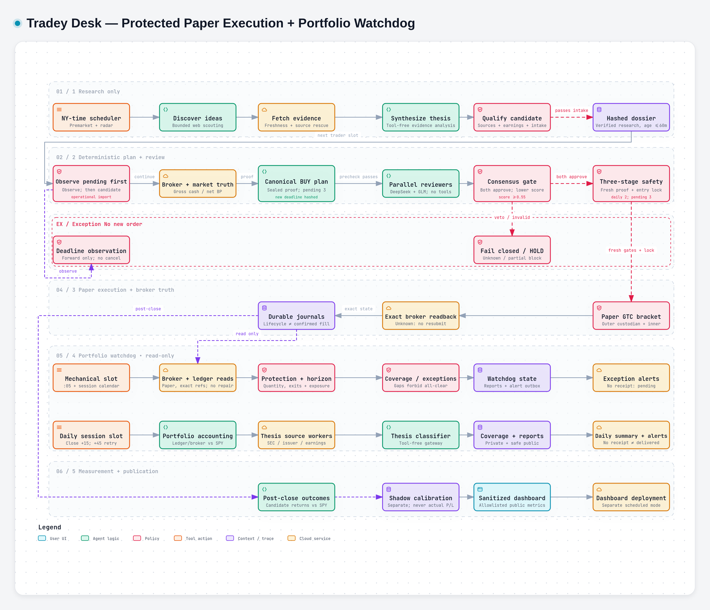

# Tradey Desk

A fail-closed, paper-first Alpaca trading desk. Submission requires `autonomy_config.json.enabled=true`, paper mode, no `KILL_SWITCH`, and every deterministic/review gate. The candidate snapshot has **enabled=true**; this is a checked-in setting, not evidence of deployment or scheduler activation. Commit `0d3a5a554bf2c36b758f085ab46e56d2a317f7a8` is a frozen candidate-only local pin, **NOT deployed**. The final independent offline review returned **PASS**, and its 16 reviewed source-file hashes match this candidate pin. Publication is user-authorized; this is approval to publish the reviewed code and artifacts, not evidence of deployment, scheduler activation or broker execution. Frozen offline remediation logs report fast=494, scenario=284, full=896 and raw discovery=896 passing; tests were not rerun by the artifact worker. Raw discovery retains 20 pre-existing SQLite ResourceWarning lines. Release approval is issued separately by the parent owner.

## Safety boundary

- US listed common stocks only; funds/ETFs/ETNs, options, crypto, OTC, short sales, margin usage, penny stocks, and illiquid names are rejected.
- Aggregate managed-exposure cap: **$10,000**; per-position cap: **$500**; at most **3 submissions/day**, including unknown submissions by original New York submission date. The enabled `exact_owned_zero_fill_v1` policy separately allows up to **3 exactly qualified zero-fill pending parents** across sessions; capacity is not approval.
- Each new position is also capped at **$40 of planned stop loss** in the observed checked-in configuration (a documentation correction, not a new risk-policy authorization). Whole-share quantity is the minimum allowed by stop risk, the $500 position cap/headroom, available cash, buying power, and remaining managed-exposure headroom. If one protected whole share does not fit, the trade is blocked.
- Fractional-quantity validation is implemented but execution remains disabled because Alpaca currently rejects fractional bracket/OCO orders; it must not be enabled unless broker-attached stop/target protection is verified.
- Orders are GTC limit brackets with an attached stop and target.
- GPT-5.6-SOL gets only the read-only `mcp-alpaca` toolset. Its broker claims are overwritten field-by-field from a deterministic MCP snapshot, including explicit nulls and empty lists.
- DeepSeek V4.1 Flash (`deepseek/deepseek-v4.1-flash`) and Z.ai GLM 5.3 Flash (`z-ai/glm-5.3-flash`) run through Nous Portal OAuth. They receive the same immutable evidence and canonical proposal in separate, concurrent, tool-free Hermes processes. Any unavailable, malformed, low-confidence, vetoing, hash-mismatched, or disagreeing review strips the order.
- The execution bridge is deterministic Python and exposes only stock limit bracket placement with a stable Alpaca `client_order_id`.
- Liquidity and technical levels use adjusted Massive consolidated daily aggregates and exclude the current partial session. The research model no longer supplies volume, stop, or target values.
- Every market-data value carries explicit provenance. By explicit paper-trading policy, Alpaca IEX is the permitted execution-reference quote and its one-venue spread is checked against the configured spread limit; it is never labeled or described as consolidated NBBO.
- Earnings timing uses an exact sourced event timestamp. The deterministic broker-calendar path classifies it as upcoming, reported, or unknown and applies the blackout only to upcoming events within the configured session window.
- Reward/risk is recomputed from the exact final limit, stop, and target. Model-stated ratios are overwritten, and final limit prices must remain close to the fresh permitted quote.
- Only confirmed fills enter `trade_journal.jsonl`; every proposal/rejection/placement/fill/failure enters `order_ledger.jsonl`. Pending acceptance/lifecycle observations never create a phantom confirmed fill.

## Process flow diagram



[View full-size workflow preview](docs/process-flow/tradey-desk-preview.png) · [Interactive HTML and editable specification](docs/process-flow/README.md)

The preview is rendered from the source-pinned workflow HTML. It includes the independent, monitoring-only portfolio watchdog: in-session mechanical checks and post-close accounting/thesis monitoring, with visible coverage gaps and receipt-honest alert delivery. GitHub READMEs cannot run interactive HTML or JavaScript; download [the standalone HTML](docs/process-flow/tradey-desk.workflow.html) and open it in a browser for interactive exploration. The diagram pins the frozen candidate source, corrects the old DAY/$25 narrative to observed GTC/$40, and does not change trading controls. Its automated artifact/browser validation is not release approval.

## Codebase knowledge graph

[Explore the Graphify graph, report and integrity notes](graphify-out/README.md). Consult its own revision/scope manifest for the independently refreshed source-only corpus, including the portfolio watchdog; do not infer freshness from this README. It is a structural navigation aid—not a verified runtime call graph or trading safety audit.

## Simplified decision workflow

1. **Research:** the radar proposes a sourced thesis, catalyst, setup type, exact `planned_exit_at`, and horizon rationale. It does not choose an executable limit, stop, target, quantity, confidence, or reward/risk.
2. **Pending first, then broker and market truth:** operational reconciliation observes pending orders before missing/stale/already-reviewed candidate skips. Pending acceptance does not suppress a later eligible candidate; confirmed-exit return paths are separate. Exact saved zero-fill parent/child ownership is required; unknown/manual/unlinked orders, partial fills and same-symbol pending entries block. A sealed current-snapshot/local-state proof is required for the conditional three-parent path. Deterministic code reads gross-cash and available-net buying-power contracts and authoritative regular-session open/close calendar rows. Gross cash reserves pending notional once; net buying power is capped separately, never subtracted twice; exposure headroom also reserves pending notional. No margin spending is authorized. **Snapshot:** deterministic code retrieves the current Alpaca paper account, positions, open orders, common-stock eligibility, fresh two-sided IEX quote, completed Massive consolidated daily bars/volume, earnings state, and Alpaca exchange sessions through the planned exit.
3. **Horizon and new-intent deadline:** immutable forward-only entry metadata is hashed with the proposal: short 1–5 sessions at placement-session regular close; swing 6–30 at the next actual session regular close, using New York calendar/DST/holidays/early closes. It is not the investment holding deadline. Expiry is **OBSERVATION ONLY**, safe parent cancellation capability remains false, and legacy intents without metadata (including legacy UBER) are never retrofitted. Passing a deadline never frees a slot, cash/exposure reservation or daily quota; exact broker-confirmed lifecycle reconciliation is required. **Horizon classification:** Python counts exchange sessions and assigns the rubric: **1–5 sessions = `short_1_5`**; **6–30 sessions = `swing_6_30`**. Missing calendars, invalid ranges, and any supplied session-count mismatch fail closed.
4. **Canonical proposal:** for a BUY, Python fixes the limit to the fresh IEX ask and derives stop/target from completed daily bars. Momentum/breakout setups use 1.25× ATR risk and a 2.25× ATR target; 6–30-session fundamental/industry setups use 1.5× ATR risk and a 3× ATR target; pullback/mean-reversion setups use the buffered 10-session low and 20-session high. The independent 1.6:1 reward/risk gate can still reject any geometry. Python computes a positive whole-share quantity under every risk/cash/exposure cap, then SHA-256 hashes the immutable proposal.
5. **Independent review:** both reviewers evaluate exactly that proposal hash. They return only `proposal_hash`, `decision`, 0–5 component scores, fatal flags, and normalized reason codes; they cannot alter the order.
6. **Deterministic aggregation:** Python applies fixed horizon-specific rubric weights, requires both approvals, rejects fatal flags or malformed/hash-mismatched responses, and uses the lower reviewer score. The current go/no-go threshold is **0.55**; it is an uncalibrated conviction score, not a win probability and not a sizing multiplier.
7. **Final safety and execution:** all quote, spread, reward/risk (**minimum 1.6:1**), planned-risk, cash, exposure, earnings, eligibility, order-count, and account-state checks run again against fresh broker data. Initial pre-review proof and post-review revalidation are followed by fresh broker-review requalification; all three stages run under the canonical cross-process `.entry_state.lock`, with contention fail-closed. Only the exact reviewed GTC limit bracket with attached stop and target may be submitted, followed by broker readback and reconciliation.

If a successful reviewer process returns no parseable JSON, the same isolated model receives exactly one **formatting-only** repair request. It may only reformat its prior answer; missing or ambiguous fields must become a fail-closed HOLD. Process failures, timeouts, valid-but-malformed schemas, and substantive vetoes are never retried.

### Reviewer rubric weights

- `short_1_5`: catalyst 30%, price/volume confirmation 25%, technical structure 20%, market regime 10%, fundamental trajectory 10%, valuation expectations 5%.
- `swing_6_30`: catalyst 20%, price/volume confirmation 20%, technical structure 20%, market regime 10%, fundamental trajectory 20%, valuation expectations 10%.

## Adaptive research budgets

Premarket/radar retains its **540-second outer timeout**, with an active deadline
of **510 seconds** and **30 seconds reserved for final overhead**. Discovery stays
capped at 165 seconds, focused retrieval at 120 seconds (four model turns), and
the shared evidence fetch/rescue pipeline at 120 seconds. There is one discovery
and at most three distinct candidate attempts; qualification, source receipts,
earnings, and execution-risk gates are unchanged.

Synthesis alternatives share one **90-second monotonic phase window**, rather
than resetting a per-candidate phase allowance. Intermediate enrichment, intake,
and deferred rescue advance this clock. Each synthesis subprocess still has a
60-second ceiling and the unchanged model flags `--run-budget 45 --max-turns 1`.
Before every launch, its timeout is clipped to the smaller of the phase time left
and the active time left **minus remaining enrichment**. If fewer than 30 seconds
remain, no subprocess is launched: the last candidate-local rejection is preserved,
or `research_synthesis_timeout` is returned if there is no such rejection.
Deferred rescue also reserves this viable launch window and remaining enrichment;
it never resets the original phase deadline.

Enrichment retains **45 cumulative active seconds across all candidates**. Each
earnings/market-data section uses `min(active_deadline, now + remaining_enrichment)`
and deducts elapsed time even on exceptions. Later synthesis does not consume the
enrichment allotment; final enrichment remains bounded by the active deadline.
These adaptive caps are **not additive**: the extra synthesis opportunity borrows
unused earlier-stage headroom. Launch and enrichment deadline clipping retain the
510-second active envelope and the 30-second final overhead reservation; the outer
540-second process timeout remains the hard backstop. A pre-existing limitation
remains in SEC metadata helpers: socket timeouts do not impose an absolute deadline
on trickling HTTP body reads, so the overhead reserve is not an unconditional
whole-pipeline guarantee. This change does not alter those source adapters.

Regression verification uses deterministic mocked subprocesses and local fixture
roots, including a 30-second synthesis + 8-second enrichment + rejection followed
by a successful second 30-second synthesis, global clipping, minimum-window
no-launch, shared deferred-rescue deadlines, and cumulative enrichment exhaustion.
Do not validate these budgets with live research or broker calls.

## Shadow calibration

Every real review cycle also writes a private, no-execution shadow decision under `test_artifacts/shadow/`. It records the exact hypothetical canonical entry, stop, target, quantity, proposal hash, rubric, both reviewer scores, and whether the proposal would have traded. Fixture and live dry runs do not enter this dataset.

The post-close routine measures shadow outcomes versus SPY and writes `calibration_report.json` for threshold ladders from 0.40 through 0.80. These files remain separate from `order_ledger.jsonl`, `trade_journal.jsonl`, operational candidate outcomes, and the public dashboard. Shadow results measure decision quality rather than guaranteed fill quality and must not be presented as actual performance.

## Credentials (not stored in this repo)

The configured Hermes MCP uses `${ALPACA_API_KEY}` and `${ALPACA_SECRET_KEY}` with `ALPACA_PAPER_TRADE=true`; consolidated volume uses `${MASSIVE_API_KEY}`. Decision reviews use the active Hermes Nous Portal OAuth session; no separate DeepSeek or Z.ai API keys are required. Dashboard deployment requires `VERCEL_TOKEN`. Put secrets in the active Hermes profile's secret store, never in prompts or source files.

## Transactional journal storage

Operational journals use `private/trading_journal.sqlite3` as the transactional read store. Operational reconciliation explicitly imports compatibility projections when an existing database is present; `verify_only` qualification does not import, initialize, checkpoint or repair business data. It preserves JSONL/SQLite bytes under the cooperating storage lock, permits coordination-lock creation, and returns typed repair-required for unsynchronized projections/lifecycle repair. Nonempty WAL/recovery state and divergent/corrupt histories fail closed. WAL mode, full synchronous commits, append-only sequencing, payload digests, and uniqueness constraints protect order intents, confirmed-fill closure keys, notification transitions, and replacement-protection registrations. The existing JSONL files remain durable compatibility projections for established forensic and reporting workflows; every append updates both stores under the shared ledger lock, and readers fail closed if their histories diverge. Dry-run ledgers use an isolated database under `test_artifacts/private/` and never enter operational metrics.

The initial cutover is deliberately non-rolling because old JSONL-only writers do not acquire the SQLite ledger lock:

1. Pause every process that can read or append an operational ledger.
2. Run `python3 sqlite_ledger.py migrate --root /path/to/tradey-desk`.
3. Run `python3 sqlite_ledger.py verify --root /path/to/tradey-desk` and require `"ok": true` with the expected stream and row totals.
4. Start only code containing the SQLite compatibility layer, then resume schedules.

Keep the database private. Create consistent snapshots with `python3 sqlite_ledger.py backup --root /path/to/tradey-desk --output /secure/path/trading-journal.sqlite3`; the command uses SQLite's backup API, validates the snapshot, fsyncs it, and installs it atomically. Retain snapshots off-host and periodically test restoration. The broker remains authoritative for orders and fills; migration does not weaken fresh broker reconciliation.

## Position/portfolio watchdog (monitoring only)

The watchdog is a read-only monitoring lane with no trading authority. The CLI now uses the concrete paper-only broker collector and bounded Massive benchmark worker. `--smoke` defaults to `test_artifacts/watchdog/smoke` and is strictly confined there: no condition transitions, outbox rows, source cutoffs, delivery or publication. `--cron` renders sanitized exception-only output for supported Hermes cron relay delivery, without inventing acknowledgment receipts. Fixture CLI invocations remain broker-unwired to prevent accidental live calls from tests.

**Activation remains gated:** reviewed credential-isolated thesis worker executables and independent review of runtime wiring are still required. No watchdog schedules have been activated by this runtime change. See [watchdog operations](docs/watchdog-operations.md) for coverage limitations and probe evidence.

## One-tree development and release

`/opt/data/projects/tradey-desk` is both the operational directory and the Git checkout. Edit, test, review, commit, and push from this directory; do not maintain a second source mirror. `origin` points to the public GitHub repository. The scheduled `cron/*.sh` wrappers also invoke this directory.

Only reviewed source/configuration/documentation should be staged by explicit path (avoid `git add .`). `.gitignore` excludes the private SQLite database and research/review files, root operational JSONL ledgers, state, generated dashboard output, and test artifacts. Existing tracked fixture and test-helper files under `test_artifacts/` are source-controlled exceptions; never put live operational records there. Review `git diff --cached --name-only` and `git diff --cached` for sensitive data before committing; verify `git ls-remote origin refs/heads/main` matches the pushed `HEAD` afterward. A Git push publishes code, whereas `deploy_dashboard.sh` separately builds and deploys sanitized dashboard output to Vercel.

## Local verification

Tests are explicitly classified in `tests/test_manifest.json`; the runner fails when a test module is unclassified, duplicated across tiers, or missing. It also snapshots operational ledgers and every file under `private/`, failing if a test changes their content or metadata.

Use the smallest sufficient tier while editing:

```bash
# Safety, durability, broker/data contracts, and test-architecture checks.
uv run --with 'fastmcp<4' python tests/run_tests.py fast

# Isolated vertical workflows across research, review, execution, reconciliation,
# notifications, diagnostics, dashboard projection, and the monitoring watchdog.
uv run --with 'fastmcp<4' python tests/run_tests.py scenario

# Required before release: fast + scenario + deep research-path coverage.
uv run --with 'fastmcp<4' python tests/run_tests.py full

# Raw-discovery cross-check; must report the same test count as `full`.
uv run --with 'fastmcp<4' python -m unittest discover -s tests -p 'test_*.py' -v
```

The normal tiers are deterministic and must not call live providers, brokers, or deployment services. External production-path smoke checks are separate, explicit, non-persisting release gates; a real paper-order canary is never part of the normal suite.

For behavior changes, first run the new focused regression test and observe the expected failure, then make it pass. During development run the affected module plus `fast` or `scenario`; before resuming automation run `full`, the raw-discovery cross-check, and any exact non-persisting external smoke required by the changed boundary.

Additional fixture checks remain available:

```bash
python3 alpha_radar.py --dry-run-fixture
python3 autotrader.py --dry-run-fixture
python3 candidate_outcomes.py --fixture fixtures/outcomes.json
python3 shadow_calibration.py
python3 public_dashboard.py
```

`autotrader.py --dry-run-fixture` must end with a blocker because autonomy is disabled and dry-run execution is forbidden.

Every deterministic rejection also appends a private, structured diagnostics row (`private/blocker_diagnostics.jsonl`; dry runs route to `test_artifacts/`) recording the measured values and configured threshold behind each reason — for example `spread_too_wide` stores bid, ask, midpoint, computed spread bps, quote feed, and `max_spread_bps`, so "how wide was the spread?" is answerable without exposing private detail publicly. The public dashboard publishes an allowlist-sanitized projection of these rows (measured + threshold only; identifiers, hashes, and any extra field are dropped) in its "Blocker details" activity column.

## Enabling

Do not set `enabled=true` until paper credentials, both model credentials, source verification, Alpaca readback, and the dashboard have all passed. Live brokerage is additionally hard-blocked by `broker_mode != "paper"`; changing that requires a code/config review and explicit user approval.
