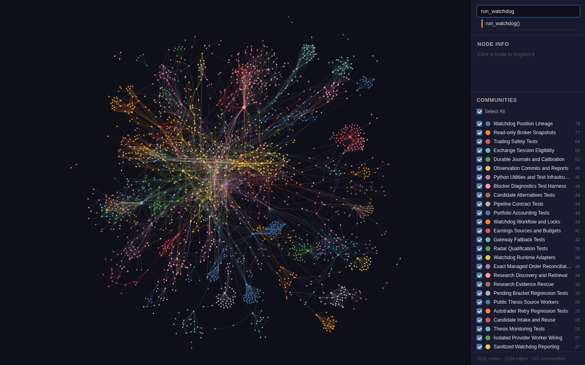

# Tradey Desk structural code graph

[Interactive graph](graph.html) · [Graph report](GRAPH_REPORT.md) · [Raw graph data](graph.json) · [Integrity diagnostics](GRAPH_HEALTH.json)



## Snapshot and scope

Graphify 0.9.75 indexed **90 Git-tracked code/test files** at source commit [`bb88070b998d5a406c99de2b252867e4caebdc2b`](https://github.com/Koktongkt/tradey-desk/commit/bb88070b998d5a406c99de2b252867e4caebdc2b). The exported graph has **2,152 nodes, 5,104 edges and 110 named communities**.

A separate, non-deployed source snapshot excluded credentials, private operational ledgers, account state and generated artifacts before detection. Documentation semantics were deliberately excluded. Structural extraction used no model/API calls. Community names were assigned by the host assistant; the extraction token counter does not count that conversation.

`SOURCE_SCOPE.json` lists the exact selected files and source revision. `EXTRACTION_AUDIT.json` retains raw extraction evidence with source paths made repository-relative. `ARTIFACT_MANIFEST.json` records publication-file hashes. Local interpreter pointers, scan-root pointers, caches, incremental manifests and the download ZIP are intentionally not committed.

## Opening and querying

GitHub displays HTML source rather than executing it. Download `graph.html` and open it in a browser. The visualization loads **vis-network 9.1.6 from an integrity-checked unpkg CDN**, so internet access is required; no graph-hosting server was deployed. Search and canvas rendering passed a Chromium smoke check at 1440×900 with no page errors (`BROWSER_VERIFICATION.json`).

With Graphify installed, run from the repository root:

```sh
graphify explain "run_watchdog"
graphify query "protection lineage" --budget 2000
graphify path "run_watchdog" "commit_observation"
```

The source revision is intentionally frozen: the graph does not automatically include future code changes. Before rebuilding, reproduce the tracked-source-only scope at the intended revision; never scan the live operational folder indiscriminately. No hooks, MCP servers or scheduled rebuilds were installed.

## Interpretation and known limitations

This is Graphify's **default undirected structural graph**, not a verified runtime call graph or trading safety audit. A shortest path may traverse file containment/import relationships rather than function calls. Tests and standard-library references are included, so highly connected nodes are not automatically production bottlenecks.

Raw diagnostics retain **468 dangling-endpoint edges, 19 self-loops and 190 collapsed same-endpoint relationships**. The builder can materialize unresolved references, which explains why exported node totals exceed explicitly extracted node totals. Inferred callback links—especially common names in tests linked to broker `pages()`—may be false positives. Preserve EXTRACTED/INFERRED labels and verify source evidence before treating any edge as architectural truth. These are graph representation limitations, not demonstrated trading defects.

The original graph HTML/JSON is unchanged by publication preparation; only audit metadata paths were normalized. Full regression validation before publication: **838 tests, zero failures/errors/skips**. No trading behavior, broker orders, risk gates or scheduler configuration was changed.
